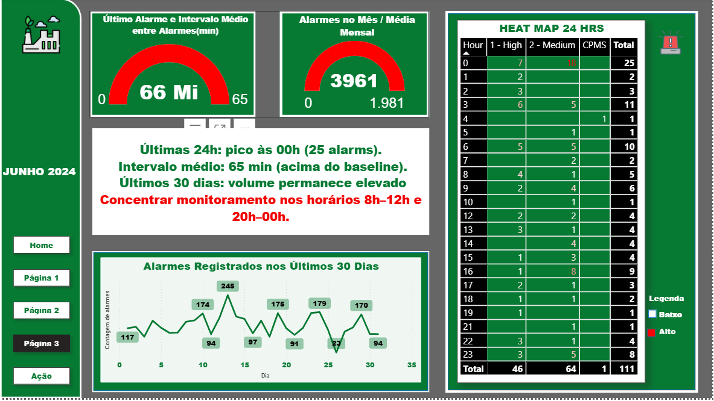

Alarmes Operacionais — Data Insights & BI

Este projeto analisa alarmes operacionais, identifica padrões e propõe ações para reduzir impacto de falhas.
O foco é transformar dados brutos → insights executáveis → plano operacional.

🗂️ Fonte de Dados

Os dados utilizados são públicos e disponíveis no Kaggle.
🔗 Dataset anonimizado com registros de trend/point/alarmes.

https://www.kaggle.com/datasets/sudhanvahg/industrial-alarm-monitoring-dataset-2018-2024

⚠️ Nenhuma informação sensível ou proprietária foi utilizada.

🎯 Objetivos

Entender comportamento de alarmes por severidade, classe e período.

Detectar picos operacionais e anomalias.

Criar plano de ação orientado a dados (data-driven).

Estabelecer governança e monitoramento contínuo.

🧰 Stack Tecnológica
Tecnologia	Função
Power BI	Modelagem, DAX e dashboards
Power Query (M)	Refino, limpeza e padronização
Excel / CSV	Entrada de dados e validações

📌 Estrutura das Análises

🔹 Insight 1 — Alarmes Offline (68,33%)

Maior volume do dataset.

Indicativo de falhas de conectividade e firmware.

🔹 Insight 2 — Severidade High (62,59%)

Tendência de falsos positivos.

Necessidade de reclassificação + ajuste de thresholds.

🔹 Insight 3 — Pico de Junho

13,34k alarmes → potencial correlação com manutenção ou campanhas.

📊 Dashboard / Relatório

O relatório em Power BI foi dividido em 4 páginas:

Overview — cenário geral, volume, severidade.

Alarmes Offline — perfil de dispositivos e impacto operacional.

Severidade High — análise de falsos positivos e eventos críticos.

Plano de Ação + Governança — responsáveis, métricas e cadência.

📋 Plano de Ação (resumo)

1️⃣ Alarmes Offline
✔ Revisão de conectividade e firmware
✔ Responsável: TI/Infra
✔ Meta: reduzir >30% em 30 dias
✔ Prazo: 15d diagnóstico / 45d estabilização

2️⃣ Severidade High
✔ Reclassificação e ajuste de threshold
✔ Responsável: Engenharia / Automação
✔ Meta: -25% falsos positivos
✔ Prazo: 30 dias

3️⃣ Pico Operacional (Junho)
✔ Análise de campanhas + manutenção
✔ Responsável: Operações + Engenharia
✔ Meta: 3 causas raiz + 2 ações corretivas
✔ Prazo: 14d RCA / 45d implantação

🧭 Governança

Ritmo: Weekly Meeting (30 min)

KPIs:

Total de alarmes/dia

% alarmes offline

% severidade high

MTTR por alarme

Ferramentas: Dashboard + histórico de eventos

🧼 Power Query — Script (M)

[ScriptM.lua — Power Query](./PowerQuery/ScriptM.lua)

📁 Estrutura do Repositório
📦 alarms-bi
├── data/                 # CSV / dataset Kaggle
├── powerquery/           # Scripts M
├── dashboards/           # PBIX, visualizações
├── docs/                 # Imagens e relatórios
└── README.md

🔐 Licença

Este projeto é de caráter educacional.
Os dados utilizados são públicos e disponibilizados no Kaggle.

👨‍💻 Autor

Victor Gagliano
📩 linkedin.com/in/…
📊 Análise de Dados | BI | Operações

