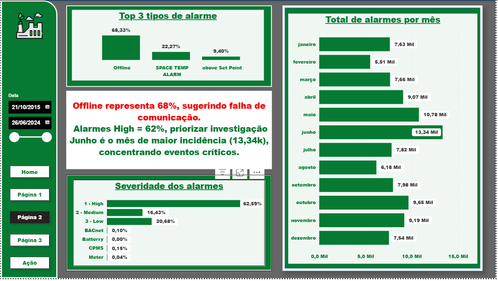

## 📊 Dashboard — Análise Estratégica

## 📁 Fonte de Dados

Dataset utilizado:

Industrial Alarm Monitoring Dataset (2018–2024)
Disponível no Kaggle:

🔗 https://www.kaggle.com/datasets/sudhanvahg/industrial-alarm-monitoring-dataset-2018-2024

O conjunto de dados contém registros históricos de alarmes industriais coletados entre 2018 e 2024, incluindo:

ProcessID — Identificador único do processo

AssetID — Identificador do ativo

AlarmSeverityName — Severidade do alarme

State — Transição do estado do alarme

TransactionMessage — Mensagem descritiva

Stage — Estágio do alarme

AlarmClassName — Classe do alarme

DateTime — Timestamp do evento

Variáveis temporais (Ano, Mês, Dia, Hora, Estação)

A base apresenta características típicas de dados industriais reais:

Alta cardinalidade textual

Eventos recorrentes

Necessidade de padronização

Estrutura não modelada para BI

## 🔄 Pipeline de Dados (ETL)

O processo de ETL foi realizado no Power Query (Linguagem M) dentro do Power BI.

## 🧼 Script Completo — Power Query (M)

[ScriptM.lua — Power Query](./PowerQuery/ScriptM.lua)

## 📥 Extração (Extract)

Importação do arquivo CSV bruto

Promoção automática de cabeçalhos

Definição manual de tipos de dados

## 🧹 Transformação (Transform)

Principais etapas aplicadas:

1️⃣ Padronização de Tipos

Conversão estruturada de campos datetime, categóricos e numéricos.

2️⃣ Separação de Data e Hora

A coluna DateTime foi dividida em:

Data

Hora

Permitindo análise temporal detalhada.

3️⃣ Tratamento da Mensagem do Alarme

A coluna TransactionMessage foi:

Dividida por delimitador

Reestruturada

Consolidada no campo Type_of_alarm

Objetivo: reduzir ruído textual e permitir agrupamentos estratégicos.

4️⃣ Limpeza Estrutural

Remoção de colunas não estratégicas

Exclusão de duplicatas com base no ProcessID

Reorganização estrutural do dataset

Padronização de categorias

## 📤 Carga (Load)

Após tratamento:

Dados carregados no modelo do Power BI

Criação de medidas DAX

Modelagem temporal

Construção de dashboard executivo

## 📊 Dashboard Executivo

O dashboard foi desenvolvido para oferecer visão estratégica da operação, destacando:

Volume total de alarmes

Distribuição por severidade

Concentração por tipo

Análise temporal

Ranking de ativos críticos

## 🔍 Insight Estratégico

Foram identificados 13,34 mil alarmes no período analisado, com concentração relevante em determinados ativos e categorias.

Essa volumetria indica:

Possível correlação com ciclos de manutenção

Potencial impacto de campanhas operacionais

Indícios de padrão estrutural, não apenas eventos isolados

A concentração de eventos severos em ativos específicos sugere necessidade de:

Revisão de manutenção preventiva

Monitoramento direcionado

Avaliação de confiabilidade operacional

## 📈 Métricas Desenvolvidas

Frequência de alarmes por ativo

Distribuição por severidade

Análise temporal (ano, mês, estação)

Ranking de ativos críticos

Identificação de padrões de recorrência

## 🚀 Próxima Evolução do Projeto

Planejamento das próximas etapas:

Cálculo de MTBF (Mean Time Between Failures)

Índice de criticidade ponderado

Análise de reincidência por ativo

Modelo preditivo simplificado

Simulação de impacto financeiro (downtime estimado)

## 🛠 Tecnologias Utilizadas

Power BI

Power Query (Linguagem M)

DAX

Modelagem Analítica

## 🎯 Objetivo Estratégico

Demonstrar capacidade de:

Trabalhar com dados industriais reais

Estruturar base bruta via ETL

Criar métricas de confiabilidade

Traduzir dados operacionais em decisões estratégicas

Simular ambiente corporativo real
